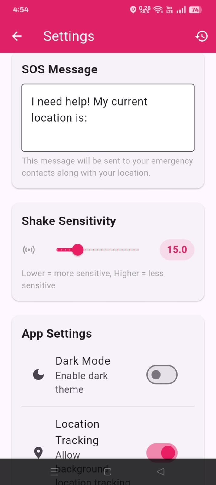
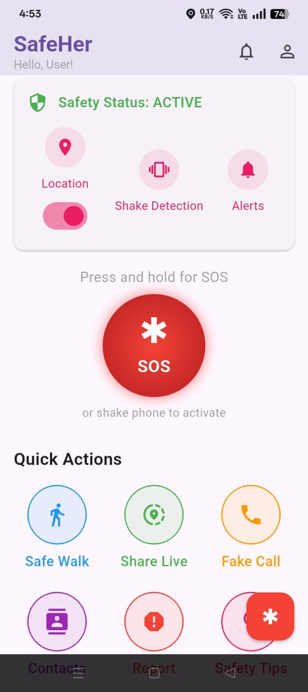
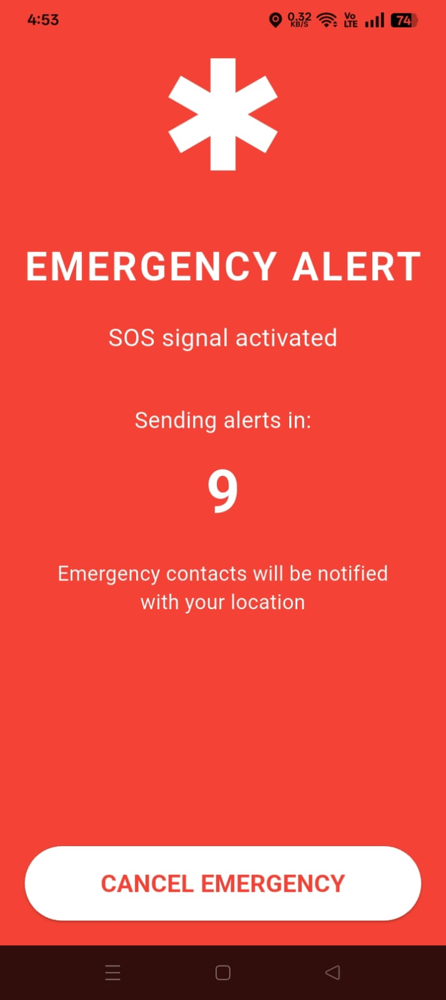
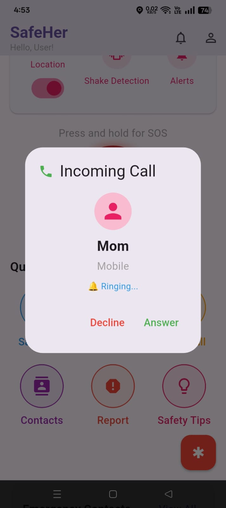

# SafeHer – Women’s Safety App

[](https://flutter.dev)
[](LICENSE)

**SafeHer** is a comprehensive women’s safety application built with Flutter. It provides one‑tap SOS alerts, live location sharing, fake call simulation, and safety tips to help women feel more secure in everyday situations.

 

## Features

- **SOS Button** – Long press or shake phone to instantly notify your emergency contacts.
- **Fake Call** – Simulate an incoming call to get out of uncomfortable situations.
- **Safe Walk** – Share your live location with trusted contacts during walks.
- **Emergency Contacts** – Manage up to 5 contacts who will receive your alerts.
- **Location Tracking** – Real‑time map view and address sharing.
- **Incident Reporting** – Report incidents anonymously with description and optional photo.
- **Safety Tips** – Curated list of safety advice for different scenarios.
- **Settings** – Customise SOS message, shake sensitivity, dark mode, and notifications.
- **Authentication** – Email/password sign up and login using Firebase.

## Tech Stack

- **Frontend**: Flutter (Dart)
- **Backend**: Firebase (Auth, Firestore, Cloud Messaging, Storage)
- **Maps & Location**: Google Maps, Geolocator
- **Notifications**: Firebase Cloud Messaging + local notifications
- **Sensors**: Shake detection (accelerometer)
- **Permissions**: Permission Handler
- **Storage**: Shared Preferences (local settings)
- **Other**: Vibration, audioplayers, just_audio, flutter_phone_direct_caller

## Getting Started

### Prerequisites

- Flutter SDK (>=3.0.0)
- Android Studio / VS Code
- Firebase project (with google-services.json for Android)

### Installation

1. **Clone the repository**  
   ```bash
   git clone https://github.com/fati-098-ma/SafeHer.git
   cd SafeHer


 Install dependencies

bash
flutter pub get


Configure Firebase

Create a Firebase project at firebase.google.com.

Add an Android app with package name com.example.safeher.

Download google-services.json and place it in android/app/.

Enable Email/Password authentication in Firebase Console.

Set up Firestore database in test mode.

Run the app

bash
flutter run


Project Structure
text
lib/
├── models/          # Data classes (UserModel, EmergencyContact)
├── screens/         # UI screens (auth, home, contacts, etc.)
├── services/        # Business logic (auth, database, location, sms, etc.)
├── utils/           # Constants, themes, helpers
└── widgets/         # Reusable UI components
Screenshots
<!-- Add screenshots here – you can create a /screenshots folder -->
Home Screen	SOS Alert	Fake Call
 	 
Contributing
Contributions are welcome! Please open an issue or submit a pull request.

License
This project is licensed under the MIT License – see the LICENSE file for details.

Contact
Developer: Muntaha Fatima 

Project Link: https://github.com/fati-098-ma/SafeHer

text

---

## Additional Tips

- Add a **LICENSE** file (e.g., MIT) if you want to allow others to use your code.
- Include a **screenshots** folder in the repository and reference images in the README.
- Keep the `google-services.json` **out of version control** (already ignored if you added it to `.gitignore`). Never commit API keys or secrets.
- Write a clear **commit message** for each significant change.

Once you push, your repository will be live on GitHub with a clean README. Good luck with your SafeHer app!
